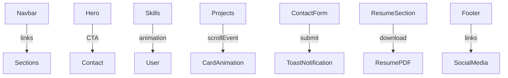

# 📄 Portfolio Website of Joshi Nihal — Documentation

Welcome to the documentation for the **Portfolio Website of Joshi Nihal**!  
This site is a modern, interactive portfolio showcasing Nihal’s skills, projects, and a contact mechanism for potential collaboration or feedback.

---

## 📚 Index

1. [Overview](#overview)
2. [File Structure](#file-structure)
3. [Features](#features)
4. [Technology Stack & Dependencies](#technology-stack--dependencies)
5. [Deployment Instructions](#deployment-instructions)
6. [Detailed File Documentation](#detailed-file-documentation)
    - [index.html](#indexhtml)
    - [style.css](#stylecss)
    - [talk.html](#talkhtml)
7. [Component & Data Flow](#component--data-flow)
8. [Customization](#customization)
9. [FAQ](#faq)
10. [License](#license)

---

## 📝 Overview

This project is a **personal portfolio website** designed and developed by Joshi Nihal. It’s built for:

- Showcasing technical skills, projects, and experience
- Providing a way for visitors to contact Nihal
- Presenting a modern, visually appealing web presence

---

## 📁 File Structure

| File Name      | Description                                         |
|----------------|-----------------------------------------------------|
| `index.html`   | Main landing page and portfolio sections            |
| `talk.html`    | Dedicated “Let’s Talk”/Contact landing & form       |
| `style.css`    | Custom CSS for typography and global styles         |
| `resume.pdf`   | (expected) Resume document for download             |
| `nihal.jpeg`   | (expected) Profile image                            |
| `about.png`    | (expected) About section illustration/image          |

---

## ✨ Features

- Fully responsive layout (mobile & desktop)
- Animated transitions and skill progress indicators
- Modern navigation with mobile menu (Alpine.js)
- Project showcase cards with animated appearance
- Downloadable resume
- Contact forms with validation & user feedback (toast messages)
- “Let’s Talk” page with testimonials and motivation for contact
- Social media integration (LinkedIn, Instagram)

---

## 💻 Technology Stack & Dependencies

| Technology      | Purpose                                               |
|-----------------|-------------------------------------------------------|
| **HTML5**       | Markup language                                       |
| **CSS3**        | Styling language                                      |
| **Tailwind CSS**| Utility-first CSS framework (via CDN)                 |
| **Font Awesome**| Icon library (via CDN)                                |
| **Alpine.js**   | Lightweight JS for reactivity/navigation toggles      |
| **Google Fonts**| Custom fonts (Playfair Display, Montserrat)           |
| **Vanilla JS**  | Custom interactivity (animations, form handling)      |

### External CDN Resources Used

- `https://cdn.jsdelivr.net/npm/alpinejs@3.x.x/dist/cdn.min.js`
- `https://cdn.tailwindcss.com`
- `https://cdnjs.cloudflare.com/ajax/libs/font-awesome/6.4.0/css/all.min.css`
- `https://fonts.googleapis.com/css2?family=Playfair+Display:wght@700&family=Montserrat:wght@400;600&display=swap`

---

## 🚀 Deployment Instructions

### 1. **Prerequisites**

- No backend required; this is a purely static website.
- You need a web server or a static hosting service (like GitHub Pages, Netlify, Vercel, or your own Apache/Nginx server).
- Ensure all files (HTML, CSS, images, and resume) are in your project directory.

### 2. **Setup Steps**

#### a. **Clone or Download the Repository**
```sh
git clone <your-repository-url>
# OR download and unzip the project files
```

#### b. **Directory Structure**
Place these files in the same directory:

```
/project-root
  |- index.html
  |- talk.html
  |- style.css
  |- resume.pdf    (Add your PDF)
  |- nihal.jpeg    (Add your photo)
  |- about.png     (Add your about image)
```

#### c. **Configure Assets**
- Replace `resume.pdf`, `nihal.jpeg`, and `about.png` with your own files (same names) for personalized content.

#### d. **Custom Domain (Optional)**
- Point your domain’s root (e.g., `A` or `CNAME` record) to your hosting platform’s IP/address.
- With GitHub Pages, add a `CNAME` file with your domain name.

#### e. **Upload/Deploy**
- **GitHub Pages:** Push to `main` branch and configure Pages in repo settings.
- **Netlify/Vercel:** Drag-and-drop, or connect repo and deploy.
- **Custom Server:** Copy files to your `public_html` or server directory.

#### f. **Test the Site**
Open `index.html` in browser or visit your deployed URL.

---

## ⚙️ Configuration

- **No build tools required**: All dependencies are loaded via CDN.
- **To customize**: Edit `index.html` and `talk.html` directly for content, and `style.css` for custom styles.
- **Images/Resume**: Update the image and PDF files for your own profile.

---

## 📑 Detailed File Documentation

---

### index.html

#### **Purpose**
The main homepage; presents the portfolio with navigation, hero, about, skills, projects, contact, resume download, and footer.

#### **Major Sections**

| Section       | Description |
|---------------|-------------|
| Navbar        | Responsive nav with links and mobile menu (Alpine.js) |
| Hero          | Introduction, profile image, CTA buttons |
| About         | Biography and current focus |
| Skills        | Circular progress indicators (animated) |
| Projects      | Animated project cards (JS triggers on scroll) |
| Contact       | Form for users to send a message (with toast notifications) |
| Resume        | Download link for resume (with animated appearance) |
| Footer        | Contact info, quick links, and social icons |

#### **Scripts and Interactivity**

- **Skill Progress Animation**: Animates SVG circles with skill percentages on scroll into view.
- **Project Card Animation**: Scales and slides project cards into place on scroll.
- **Contact Form**: Validates fields, shows error/success toasts; no backend.
- **Resume Section Animation**: Fades in resume section on scroll.

#### **Styling**
- Uses Tailwind CSS for layout and utilities.
- Custom fade/scale animations (CSS).
- Font Awesome for icons.

---

### style.css

#### **Purpose**
Adds global styling, fonts, and overrides to supplement Tailwind.

#### **Key Styles**

- Imports `Playfair Display` and `Montserrat` from Google Fonts.
- Sets a light background color (for pages not using Tailwind background).
- Applies `Montserrat` for body, `Playfair Display` for headings.
- Sets a gold highlight for text selection.
- Removes link underlines and sets pointer for links and buttons.
- Smooth scroll on anchor navigation.

---

### talk.html

#### **Purpose**
A separate, dedicated contact page with enhanced motivation for communication.

#### **Major Sections**

| Section             | Description |
|---------------------|-------------|
| Navbar              | Same as `index.html`, with links to sections/pages |
| Hero                | Large headline ("Let’s Talk"), scroll-down button |
| Contact Form        | Form with fields (Name, Email, Subject, Message); Alpine.js shows success message on submit |
| Why Contact Me      | Cards with reasons to reach out (Hire, Project, Questions, Feedback) |
| Testimonials        | Customer feedback/testimonials cards with star ratings |
| Footer              | Contact info, quick links, social icons |

#### **Scripts and Interactivity**

- **Alpine.js** handles mobile nav toggle and form submission feedback.
- **Smooth Scroll**: Scrolls to the contact form when button is clicked.
- **Form**: Shows a success message after (simulated) submission.

#### **Styling**
- Tailwind CSS for layout and color.
- Custom radial background gradient and smooth scrolling.

---

## 🔄 Component & Data Flow

> This website is static. All interactivity is client-side.

**Component Interaction Diagram:**



- **Navbar** navigates to page sections or between pages.
- **Hero** links drive users to Contact form or Resume download.
- **Skills Section** animates as it appears in viewport.
- **Projects Section** cards animate in on scroll.
- **Contact Form** validates and shows toasts (no backend).
- **Footer** provides contact info and outbound links.

---

## 🛠️ Customization

- **Colors and Styles**: Change Tailwind classes or update `style.css`.
- **Skills & Projects**: Edit relevant HTML sections to change content.
- **Contact/Resume**: Replace files for your details.
- **Animations**: Adjust timing or style in the `<style>` blocks within HTML or in `style.css`.

---

## ❓ FAQ

**Q: How do I add a new project?**  
A: Duplicate a `.project-card` in `index.html` > "Projects" section and update its content.

**Q: Where can I update my email or address? ****  
A: Edit the contact info in the footer of `index.html` and `talk.html`.

**Q: How do I hook up the contact form to my email?**  
A: Integrate a backend service (like Formspree, Netlify Forms, or your own API) and change the form's `action`/JS accordingly.

**Q: Can I use a custom font or color scheme?**  
A: Change font imports in `style.css` and update Tailwind classes in the HTML files.

---

## 📄 License

This project is for personal or educational use.  
Replace personal branding and files before re-use.

---

# 🎬 Live Demo

- Open `index.html` in your browser or deploy as described above.

---

# 🧩 Summary Table

| File         | Purpose                        | Key Technologies Used      |
|--------------|-------------------------------|---------------------------|
| index.html   | Main portfolio homepage        | HTML, Tailwind, JS, Alpine|
| talk.html    | Dedicated contact/“Let’s Talk”| HTML, Tailwind, Alpine    |
| style.css    | Global font & style overrides  | Google Fonts, CSS         |

---

**No API endpoints or backend controllers are defined; hence, no API blocks are included.**  
For dynamic functionality (email, project integration), you may extend with backend/serverless APIs as needed.

---

**Enjoy deploying and customizing your portfolio! 💡**
